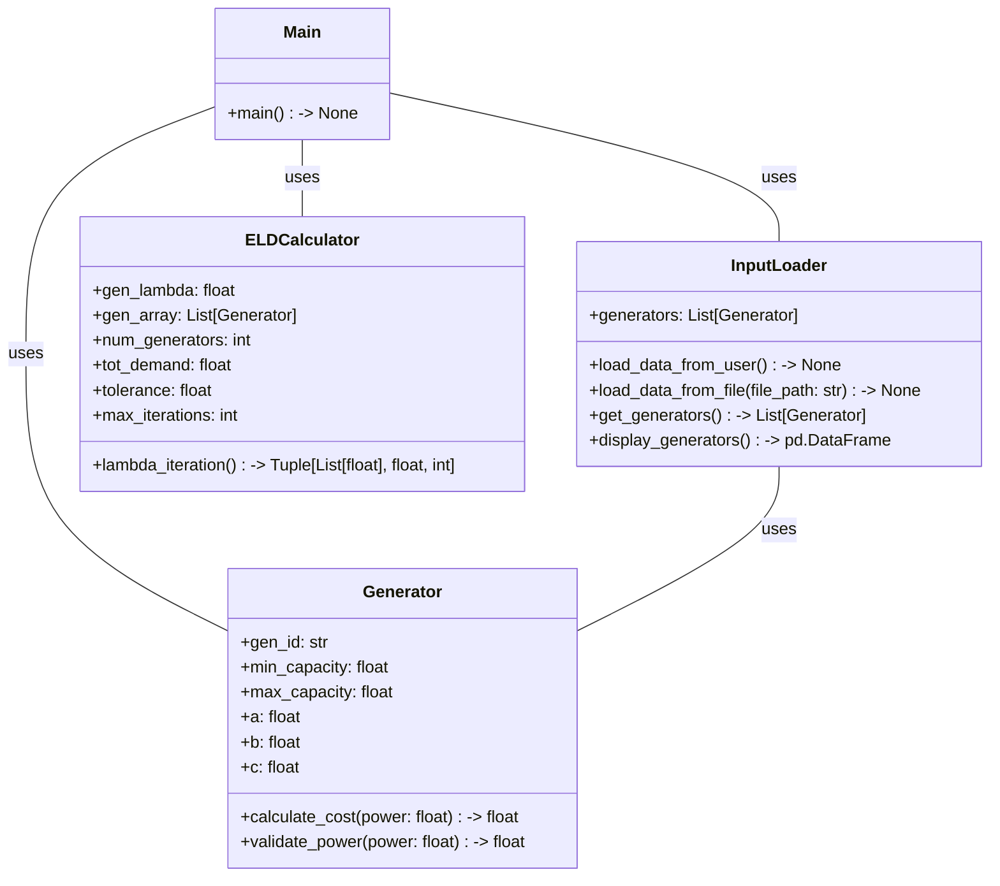

 

# eld-console-python
Economic Load Dispatch console based application using python

# Code documentation
1. [main-doc](https://sree2011.github.io/eld-console-main-doc/)
2. [java](https://sree2011.github.io/eld-console-java/)

# Python documentation

1. [Generator](./docs/src/Generator.html)
2. [InputLoader](./docs/src/InputLoader.html)
3. [ELDCalculator](./docs/src/ELDCalculator.html)
4. [Main](./docs/src/Main.html)

# Class Diagram

# References
[1] Power System Analysis by Hadi Saadat, 2010 edition
[2] IEEE 10-generator bus system